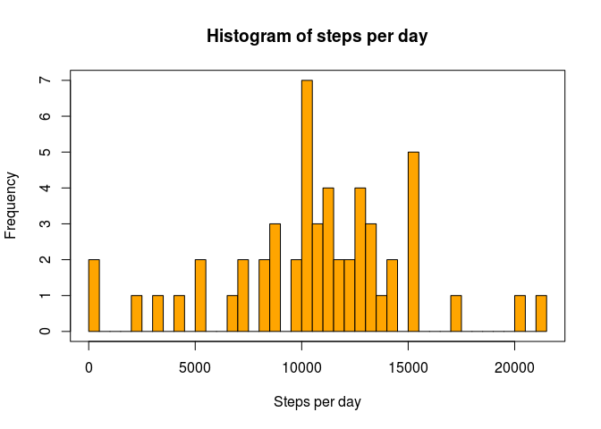
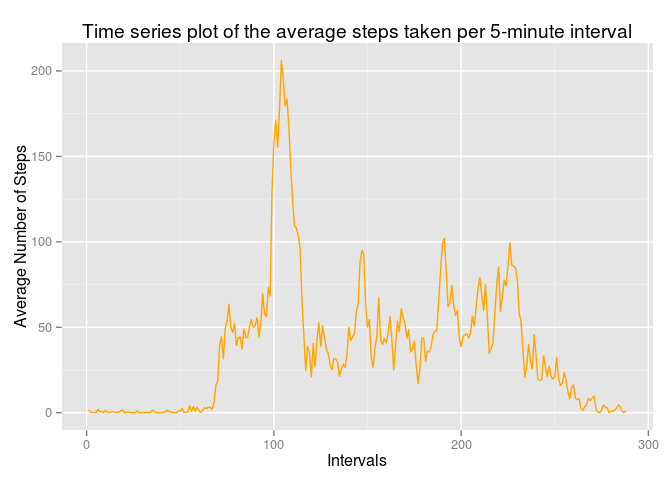
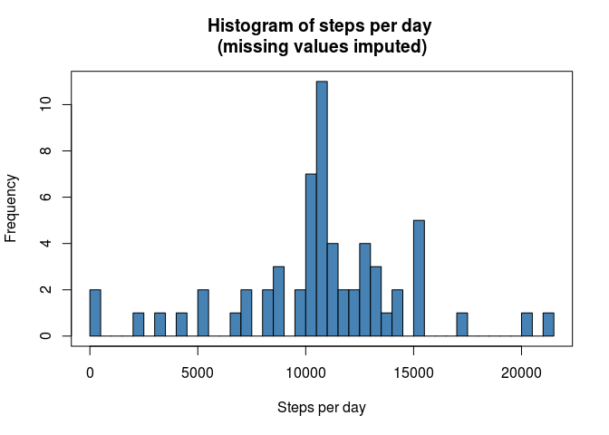
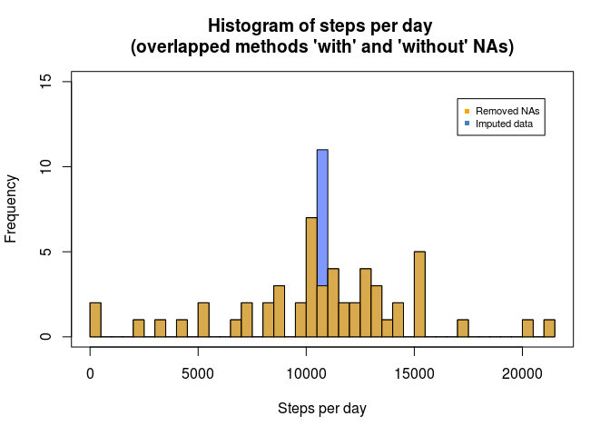
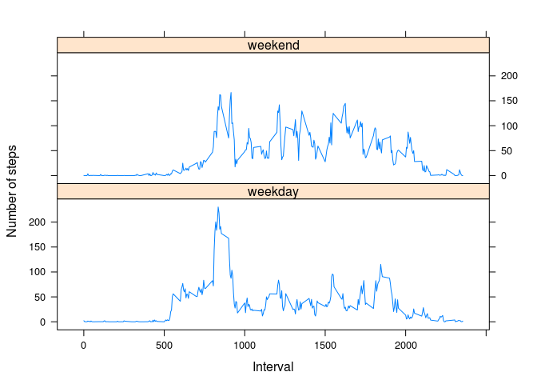

# Reproducible Research: Peer Assessment 1
Ferran Brianso (ferran.brianso@vhir.org)  
14/08/2015  

## General settings and library loadings


```r
library(ggplot2)
library(lattice)
echo = TRUE                        # to show all code
Sys.setlocale("LC_TIME", "C")      # to manage weekdays in english
```

```
## [1] "C"
```

## Loading and preprocessing the data

Unzip and load csv file

```r
unzip("activity.zip")
data <- read.csv("activity.csv", header=TRUE)
```

Preprocess some fields and review the data

```r
data$interval <- as.factor(data$interval)
data$date <- as.Date(data$date)
head(data)
```

```
##   steps       date interval
## 1    NA 2012-10-01        0
## 2    NA 2012-10-01        5
## 3    NA 2012-10-01       10
## 4    NA 2012-10-01       15
## 5    NA 2012-10-01       20
## 6    NA 2012-10-01       25
```

```r
tail(data)
```

```
##       steps       date interval
## 17563    NA 2012-11-30     2330
## 17564    NA 2012-11-30     2335
## 17565    NA 2012-11-30     2340
## 17566    NA 2012-11-30     2345
## 17567    NA 2012-11-30     2350
## 17568    NA 2012-11-30     2355
```

```r
dim(data)
```

```
## [1] 17568     3
```

Subset those cases without NA

```r
data.woNA <- na.omit(data)
rownames(data.woNA) <- 1:nrow(data.woNA)
head(data.woNA)
```

```
##   steps       date interval
## 1     0 2012-10-02        0
## 2     0 2012-10-02        5
## 3     0 2012-10-02       10
## 4     0 2012-10-02       15
## 5     0 2012-10-02       20
## 6     0 2012-10-02       25
```

```r
tail(data.woNA)
```

```
##       steps       date interval
## 15259     0 2012-11-29     2330
## 15260     0 2012-11-29     2335
## 15261     0 2012-11-29     2340
## 15262     0 2012-11-29     2345
## 15263     0 2012-11-29     2350
## 15264     0 2012-11-29     2355
```

```r
dim(data.woNA)
```

```
## [1] 15264     3
```

## What is mean total number of steps taken per day?

Using data set without NAs for this part of the assignment.

### Calculate the total number of steps taken per day

```r
steps.per.day <- aggregate(data.woNA$steps, list(Date=data.woNA$date), FUN="sum")
head(steps.per.day)
```

```
##         Date     x
## 1 2012-10-02   126
## 2 2012-10-03 11352
## 3 2012-10-04 12116
## 4 2012-10-05 13294
## 5 2012-10-06 15420
## 6 2012-10-07 11015
```

```r
tail(steps.per.day)
```

```
##          Date     x
## 48 2012-11-24 14478
## 49 2012-11-25 11834
## 50 2012-11-26 11162
## 51 2012-11-27 13646
## 52 2012-11-28 10183
## 53 2012-11-29  7047
```

### Make a histogram of the total number of steps taken each day

```r
hist(steps.per.day$x, breaks=(length(steps.per.day$x)), col="orange",
     main="Histogram of steps per day", xlab="Steps per day")
box()
```

 

### Calculate and report the mean and median of the total number of steps taken per day

```r
mean(steps.per.day$x)
```

```
## [1] 10766.19
```

```r
median(steps.per.day$x)
```

```
## [1] 10765
```

## What is the average daily activity pattern?

### Time series plot of the 5-minute interval and the average number of steps taken, averaged across all days

```r
require(ggplot2)
avg.steps <- aggregate(data.woNA$steps, list(interval=as.numeric(data.woNA$interval)), FUN="mean")
names(avg.steps)[2] <- "avgSteps"
ggplot(avg.steps, aes(interval, avgSteps)) + geom_line(color="orange") + labs(title="Time series plot of the average steps taken per 5-minute interval", x="Intervals", y="Average Number of Steps")
```

 

### Which 5-minute interval, on average across all the days in the dataset, contains the maximum number of steps?

```r
avg.steps[which(avg.steps$avgSteps==max(avg.steps$avgSteps)), ]
```

```
##     interval avgSteps
## 104      104 206.1698
```

## Imputing missing values

### Calculate and report the total number of missing values in the dataset

```r
sum(is.na(data))
```

```
## [1] 2304
```

### Create a new dataset that is equal to the original dataset but with the missing data filled in.  

In this case, the mean for the corresponding 5-minute interval (already stored in avg.steps) has been used to fill each NA steps value, rounding the values.

```r
data.filled <- data
head(data.filled)
```

```
##   steps       date interval
## 1    NA 2012-10-01        0
## 2    NA 2012-10-01        5
## 3    NA 2012-10-01       10
## 4    NA 2012-10-01       15
## 5    NA 2012-10-01       20
## 6    NA 2012-10-01       25
```

```r
head(avg.steps)
```

```
##   interval  avgSteps
## 1        1 1.7169811
## 2        2 0.3396226
## 3        3 0.1320755
## 4        4 0.1509434
## 5        5 0.0754717
## 6        6 2.0943396
```

```r
for (i in 1:nrow(data.filled)) {
   if (is.na(data.filled$steps[i])) {
      interv <- as.numeric(data.filled$interval[i])
      data.filled$steps[i] <- as.integer(round(avg.steps[which(avg.steps$interval == interv), ]$avgSteps),0)
   }
}
head(data.filled)
```

```
##   steps       date interval
## 1     2 2012-10-01        0
## 2     0 2012-10-01        5
## 3     0 2012-10-01       10
## 4     0 2012-10-01       15
## 5     0 2012-10-01       20
## 6     2 2012-10-01       25
```

```r
sum(is.na(data.filled))
```

```
## [1] 0
```

### Make a histogram of the total number of steps taken each day and calculate and report the mean and median total number of steps taken per day. 

```r
steps.per.day.filled <- aggregate(data.filled$steps, list(Date=data.filled$date), FUN="sum")
hist(steps.per.day.filled$x, breaks=(length(steps.per.day$x)), col="steelblue",
     main="Histogram of steps per day \n(missing values imputed)", xlab="Steps per day")
box()
```

 

```r
mean(steps.per.day.filled$x)
```

```
## [1] 10765.64
```

```r
median(steps.per.day.filled$x)
```

```
## [1] 10762
```

### Do these values differ from the estimates from the first part of the assignment? What is the impact of imputing missing data on the estimates of the total daily number of steps?

```r
mean(steps.per.day.filled$x)
```

```
## [1] 10765.64
```

```r
mean(steps.per.day$x)
```

```
## [1] 10766.19
```

```r
median(steps.per.day.filled$x)
```

```
## [1] 10762
```

```r
median(steps.per.day$x)
```

```
## [1] 10765
```
Yes, the values are slightly different.

```r
mean(steps.per.day.filled$x) - mean(steps.per.day$x)
```

```
## [1] -0.549335
```

```r
median(steps.per.day.filled$x) - median(steps.per.day$x)
```

```
## [1] -3
```
Not so much in case of the means (just the slight effect of rounding values before imputing NAs), and a little bit more in case of medians (due to the fact of using a mean-based method for imputation).

The overall differences can be observed with this plot of overlapped histograms

```r
hist(steps.per.day.filled$x, breaks=(length(steps.per.day$x)), col=rgb(0, 0.2, 1, 0.5), 
     main="Histogram of steps per day \n(overlapped methods 'with' and 'without' NAs)", 
     ylim=c(0, 15), xlab="Steps per day")
hist(steps.per.day$x, breaks=(length(steps.per.day$x)), col=rgb(1, 0.7, 0, 0.7), 
     add=TRUE)
legend(17000, 14, c("Removed NAs","Imputed data"), cex=0.7,
       col=c("orange","steelblue"), pch=c(15,15))
box()
```

 

Where it is clear that only the break that includes the mean value becomes much more frequent in case of the imputed data set.


## Are there differences in activity patterns between weekdays and weekends?
Using the dataset with the filled-in missing values for this part.

### Create a new factor variable in the dataset with two levels – “weekday” and “weekend” - indicating whether a given date is a weekday or weekend day.

```r
data.filled$weekdays <- factor(format(data.filled$date, "%A"))
levels(data.filled$weekdays)
```

```
## [1] "Friday"    "Monday"    "Saturday"  "Sunday"    "Thursday"  "Tuesday"  
## [7] "Wednesday"
```

```r
table(data.filled$weekdays)
```

```
## 
##    Friday    Monday  Saturday    Sunday  Thursday   Tuesday Wednesday 
##      2592      2592      2304      2304      2592      2592      2592
```

```r
levels(data.filled$weekdays) <- list(weekday = c("Monday", "Tuesday", "Wednesday", 
                                                 "Thursday", "Friday"),
                                     weekend = c("Saturday", "Sunday"))
table(data.filled$weekdays)
```

```
## 
## weekday weekend 
##   12960    4608
```

### Make a panel plot containing a time series plot of the 5-minute interval and the average number of steps taken, averaged across all weekday days or weekend days.

Adapting the data frame with average steps

```r
avg.steps <- aggregate(data.filled$steps, 
                      list(interval = as.numeric(as.character(data.filled$interval)), 
                           weekdays = data.filled$weekdays),
                      FUN = "mean")
names(avg.steps)[3] <- "avgNumOfSteps"
```

Creating the final plot

```r
require(lattice)
xyplot(avg.steps$avgNumOfSteps ~ avg.steps$interval | avg.steps$weekdays, 
       type = "l", layout = c(1, 2), 
       xlab = "Interval", ylab = "Number of steps")
```

 

Yes, there are differences in activity patterns between weekdays and weekends along the time intervals. For instance, the number of steps on weekends is more regular than on weekdays, where there is a spike of more activity around time-interval 800.
